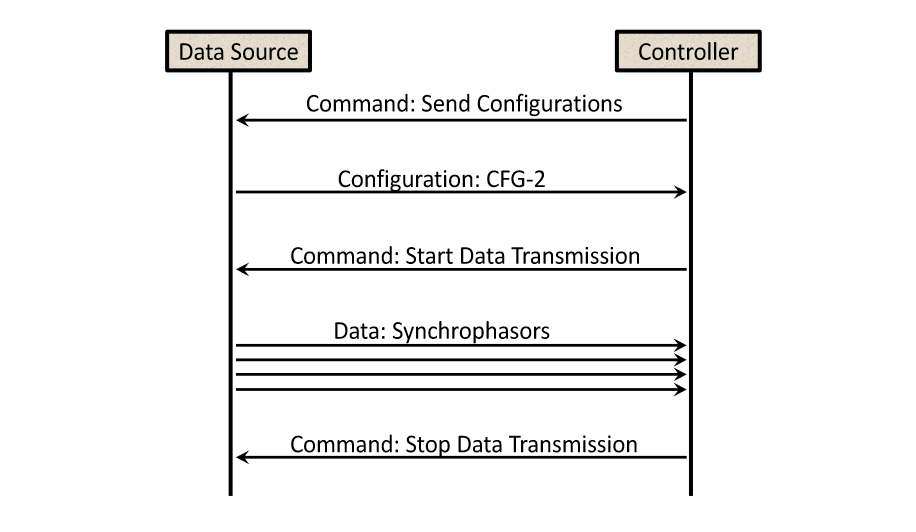
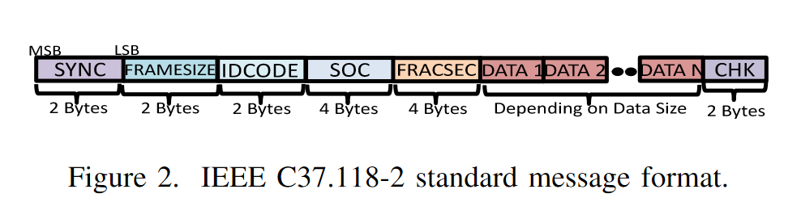
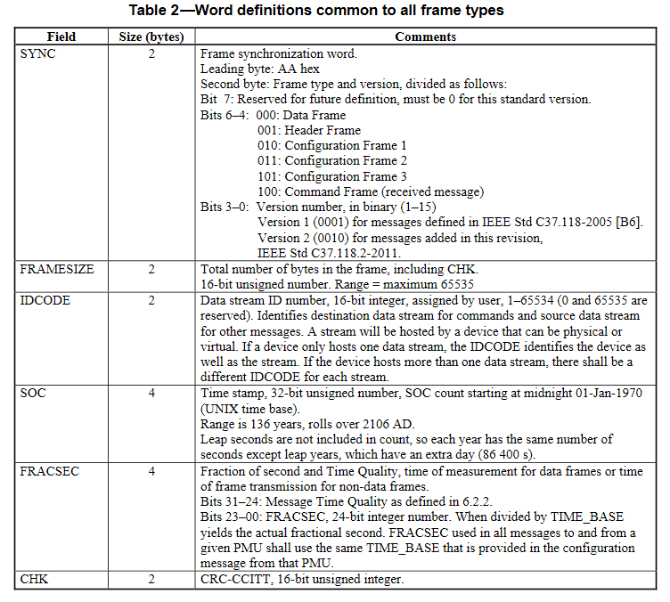
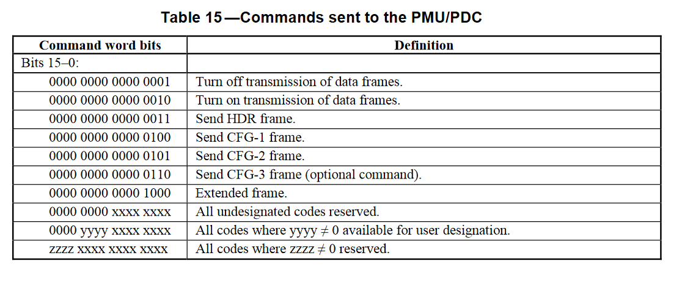
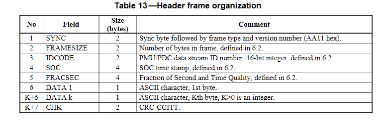
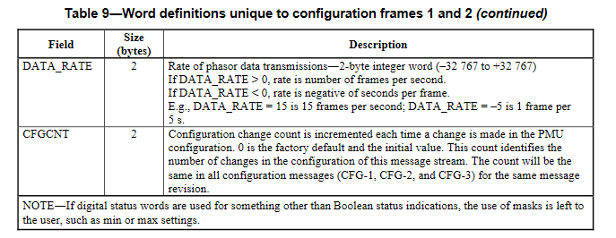

IEEE C37.118.2 is a one of the  communication protocols for [[Synchrophasor]] technology. IEEE 1344 protocol improved over time and replaced by C37.118 protocol.  The standard has been split into two parts. 
1. IEEE Std. 37.118.1-2011 which covers measurement provision
2. IEEE Std. 37.118.2-2011 covers data communication 

This document will summarize the IEEE C37.118.2 protocol, so that the user can understand and utilize the pySynphasor with lowest effort. 

## Packet Types 
Four message types are defined here: data, configuration, header, and command.
- **Data** messages are the measurements made by a PMU
- **Configuration**  is a machine-readable message describing the data types, calibration factors, and other meta-data for the data that the PMU/PDC sends.
- **Command** are machine-readable codes sent to the PMU/PDC for control.
- **Header** information is human readable descriptive information sent from the PMU/PDC.

## A Communication Scenario

- In the synchrophasor protocol, PMU acts as a server, and PDC acts as a client.
- PDC starts a session by sending a command that requests PMU to send a configuration message. Because, without a configuration packet, PDC cannot interpret the network traffic. PDC sends another command to start data transmission.
- After receiving the configuration packet. Then, PMU transmits synchrophasor data continuously at a fixed rate defined in the configuration packet until further stop command from PDC.

## Message Format

Each message begins with identification and synchronization word (SYNC) and ends with CRC checksum.  The figure represents the common packet format for the four types of message, i.e., data, configuration, command and header. Only the DATA 1, DATA 2, … DATA N is different for different types of message

## Common Frame
Type 0: data frame
Type 1: header frame
Type 2: CFG1
Type 3: CFG2
Type 4: command 
Type 5: CFG3

## Command 

The 2 bytes command set is defined the in the table 15 of the standard

## Data Frame

## Header

## Configuration

## References
[1] R. Khan, K. McLaughlin, D. Laverty, and S. Sezer, “IEEE C37.118-2 Synchrophasor Communication Framework Overview, Cyber Vulnerabilities Analysis and Performance Evaluation,” _scitepress.org_, 2016, doi: [10.5220/0005745001670178](https://doi.org/10.5220/0005745001670178).
[2] IEEE, “IEEE Std C37.118.2TM-2011,” _IEEE Std C37.118.2-2011 (Revision of IEEE Std C37.118-2005)_, pp. 1–53, Dec. 2011, doi: [10.1109/IEEESTD.2011.6111222](https://doi.org/10.1109/IEEESTD.2011.6111222).